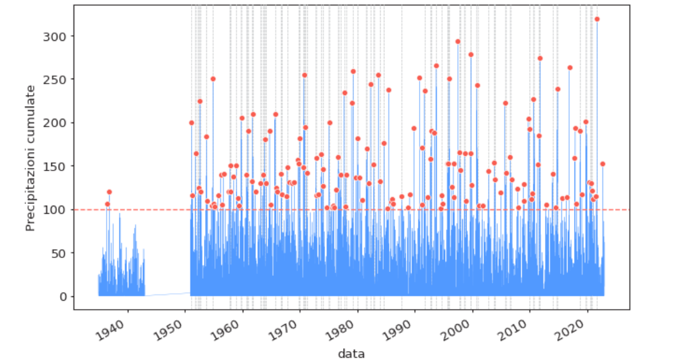
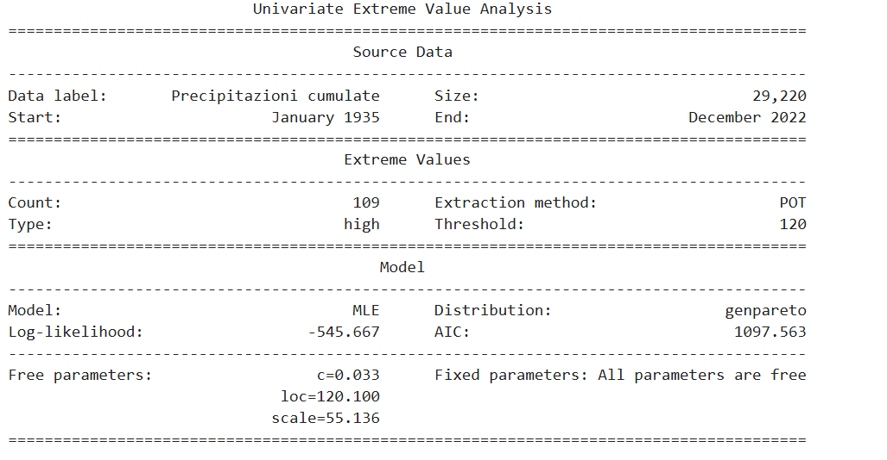
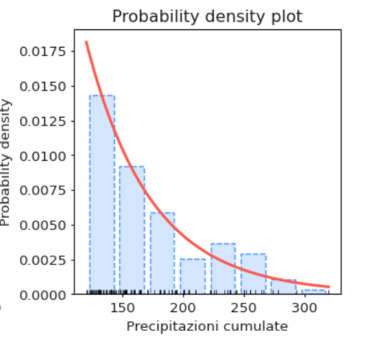
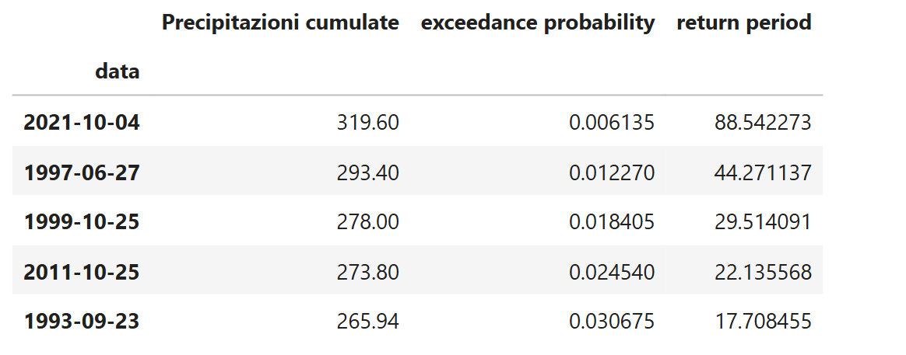

# Analisi dei valori estremi delle precipitazioni
Questo progetto si occupa di analizzare i valori estremi delle precipitazioni in Liguria (dal 1945 al 2022) utilizzando alcuni dei risultati dell'EVT (Extreme Value Thoery), una branca della statistica che descrive la distribuzione dei valori massimi/minimi estratti da una
collezione di n variabili aleatorie, che si assume siano indipendenti e provenienti dalla stessa
distribuzione di probabilità (i.i.d.). 
## Fonte dei dati
Il dataset contenente le registrazioni delle precipitazioni giornaliere in Liguria è stato scaricati dal sito dell’Istituto Superiore per la Protezione
e la Ricerca Ambientale (ISPRA)
## Riferimenti Teorici
### Selezione dei valori estremi: Peaks Over Treshold (POT)
Per ricavare i valori estremi è stata adottata la strategia Peaks Over Treshold (POT) che consiste nel selezionare come estremi i valori che superano una certa soglia prefissata.

### Risultato Teorico: Formulazione del modello asintotico per i massimi - Teorema di Pickands-Balkema-de Hann -
Fissata una soglia (alta) $\mu$, la distribuzione condizionale degli eccessi sopra soglia converge asintoticamente ad una Generalized Pareto Distribution (GPD) ovvero:
$$\mathbb{P}( X-\mu \leq y \mid X>\mu) \to GPD(y,\xi,\beta)$$
dove X è la variabile che rappresenta i millimetri di pioggia giornaliera.

### Gestione della dipendenza temporale degli estremi: scelta dei parametri interni nella routine di pyextremes
Nei dati temporali di precipitazione, gli eccessi rispetto a una determinata soglia tendono a presentarsi in gruppi (cluster), anziché in modo indipendente. Tuttavia, l'applicazione del modello basato sulla Generalized Pareto Distribution (GPD) si fonda, nelle sue formulazioni standard, sull'ipotesi di indipendenza e identica distribuzione (i.i.d) delle osservazioni estreme.
Per affrontare il problema della dipendenza temporale, viene introdotto il parametro r, che definisce il tempo minimo che deve intercorrere tra due eccessi affinché siano considerati appartenenti a cluster distinti. In questo progetto è stato scelto r=30 giorni, con l'obiettivo di separare gli eccessi associati a fenomeni perturbativi differenti. Un intervallo più breve, ad esempio 24 ore, potrebbe infatti non essere sufficiente a distinguere eventi meteorologici distinti, poiché una stessa perturbazione può generare precipitazioni intense per più giorni consecutivi.
La procedura utilizza quindi il parametro r per raggruppare gli eccessi temporalmente ravvicinati e selezionare il massimo di ciascun cluster. In questo modo, si riduce la dipendenza dovuta alla persistenza dello stesso fenomeno perturbativo, ottenendo una serie di massimi declusterizzati più plausibilmente indipendenti, da utilizzare nell'analisi EVT.
### Stima dei livelli di ritorno e dei periodi di ritorno
Denotando con M la variabile "valore estremo di precipitazione" (in mm), allora il livello di ritorno $R_T$ è quel valore che mi aspetto in media venga superato solamente una volta ogni T anni.
$R_T$ soddisfa: 

$$\mathbb{P}(M>R_T)=\frac{1}{T} \quad (*)$$

 Infatti, se vale (*), la variabile **periodo di ritorno** che conta gli anni di attesa fino al superamento successivo si comporta come una geometrica (il successo corrisponde a :"l'estremo supera $R_T$" e la probabilità di successo è $\frac{1}{T}$) che è risaputo avere valore atteso pari a $\frac{1}{\mathbb{P}(successo)}=T$
 
 Essendo $\mathbb{P}(M>R_T)=1-F(R_T)=\frac{1}{T}$, e quindi $R_T=F^{-1}\left(1-\frac{1}{T}\right)$, si ottiene l'espressione del livello di ritorno $R_T$ come funzione inversa della fz. di distribuzione stimata degli estremi.
 
 ## Struttura della repository
- `notebook/` : Jupyter Notebook contenente il codice del progetto.
- `immagini/` : Selezione di immagini contenute in questo README.
 ## Come consultare il progetto
Il Jupyter Notebook è il punto di accesso all'intera analisi e permette di approfondire gli aspetti metodologici e implementativi del progetto. Grazie all'integrazione di codice, commenti e risultati, è possibile seguire il processo di analisi nel dettaglio, compresi i vari accorgimenti operativi e le ottimizzazioni adottate.
